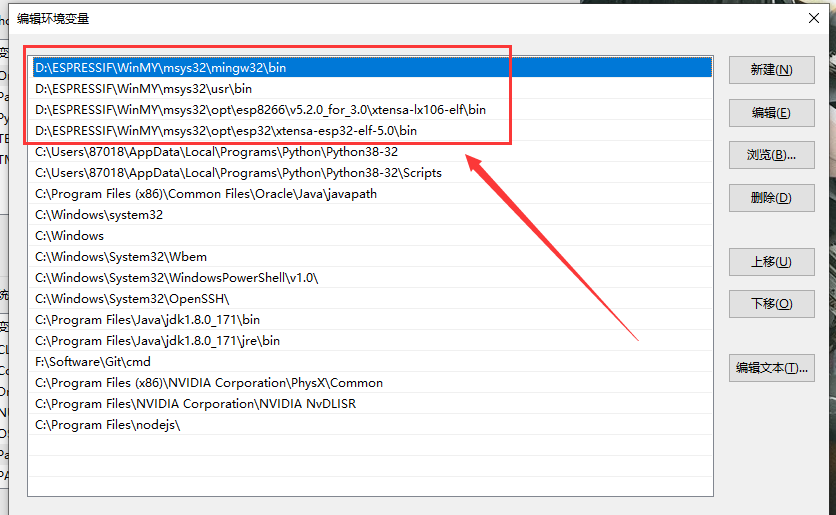

## 一 前言

众所周知，乐鑫ESP8266 SDK开发拥有多版本，包括带实时操作freeRtos系统开发，或者是裸跑开发 NONOS SDK，而这2钟方式又有版本的差异；

新手开发者不知道如何入门，那么我们为了兼容这些版本的差异和开发，为了满足更多开发者和降低门槛，我们一度地把原厂的window环境封装起来成为一个IDE，因此，我们推出了**《安信可 ESP8266/32 一体化IDE V1.5》**版本；

其特性有：

- 支持 ESP8266 的 NONOS 2.0和3.0 版本二次开发；
- 支持 ESP32 的 IDF 框架开发，支持 ESP-cam 开发板二次开发；
- 提供支持 天猫精灵IoT平台/阿里物联网生活平台/阿里飞燕/百度天工的模板SDK接入；
- 提供多种多样的demo项目，使开发者快速开发使用自己的业务；
- SDK资源开发包使用 Git 管理，用户可自行更新；

# 二 下载 IDE V1.5

我们已经封装了 `ESP8266/ESP32` 的 GUI 开发环境，您只需要下载无脑式安装即可；

安装完毕之后，我们需要添加几个环境变量到系统，下面路径根据您的安装路径有所改变：

```C
IDE安装路径\msys32\mingw32\bin
IDE安装路径\WinMY\msys32\usr\bin
IDE安装路径\WinMY\msys32\opt\esp8266\v5.2.0_for_3.0\xtensa-lx106-elf\bin
IDE安装路径\WinMY\msys32\opt\esp32\xtensa-esp32-elf-5.0\bin
```

最后可以在电脑环境变量查看:



# 三 编译一个 RTOS 操作系统代码

我们推荐各位学习 `ESP8266` 使用带操作系统SDK开发，不管用在商业或学习，必有值得借鉴的地方；

## 3.1 下载开发 SDK 资源包：

此SDK是基于官方的` RTOS master `分支上有所修改，并增加了开发模板，详情见 README 文档；
因为SDK和开发环境是分开的，所以下载的地方随心所欲；

但是强调：**下载路径务必不能带空格或中文字符**！


- 下载时候务必要把子模块拉取下来，不能直接点击 `download` 下载，否则得到的是一个不完整的开发包！！
- 所以，请自行百度教程安装 git 版本管理的软件；

```
git clone --recursive https://gitee.com/xuhongv/AiThinkerProjectForESP.git
```

## 3.2 导入安信可IDE

1. 点击C/C++分支，选择 `Existing Code as MakeFile Project` 工程;
2. 复制刚刚的下载的文件夹路径，`import -->  Cross Gcc` , 并且去掉对应的 `C++` 勾勾；

&nbsp;&nbsp;&nbsp;&nbsp; **主要步骤如下动图操作所示（忽略文件夹名字）：**


## 3.3 配置环境步骤：

 1. 项目属性设置，鼠标选中项目名称右键点击，在右侧菜单中选择Properties 
 2. 在 `Properties --> C/C++ Build --> Build directory` 选择编译的工程路径，比如 `examples\get-started\project_template` 工程。
 3. 添加IDF环境变量在 `Properties --> C/C++ Build --> Environment` 点击Add ，路径为刚刚的下载的文件夹路径，变量名字为 `IDF_PATH`;
 4. 然后点击 OK 保存退出！
 5. 控制台输出只保留 `Console` ，其他一律关闭！

 &nbsp;&nbsp;&nbsp;&nbsp; **主要步骤如下动图操作所示（忽略文件夹名字）：**


## 3.4 编译步骤：

&nbsp;&nbsp;&nbsp;&nbsp;与其他版本不一样， rtos3.0或以上支持面板设置参数，即通过 `make menuconfig` 设置，同样地，我们可以利用快捷键去快速设置；

 1. 构建menuconfig菜单，选中项目名称，在右键菜单中选择 `Make Targets --> Create`；或者快捷键 `Alt + F9` ;
 2. 在弹出的对话框中取消勾选`Same as the target name` 与 `User builder settings` 这2个选项，并且
在`Build command` 中输入`mintty.exe -e make menuconfig`。


&nbsp;&nbsp;&nbsp;&nbsp; **如下动图操作所示（忽略文件夹名字）：**


&nbsp;&nbsp;&nbsp;&nbsp; 然后，就可以编译工程了，点击 `Build Project`，编译过程需要的时间5分钟以上，取决电脑配置，耐心等待，当出现以下信息，说明编译成功！


## 3.5 下载步骤：
&nbsp;&nbsp;&nbsp;&nbsp; 配置快捷键进行下载，其命令是  `make flash` ，如果指定端口进行烧录下载固件比如 `com12` 的话，可以这样写： `make flash ESPPORT=COM12` ；

&nbsp;&nbsp;&nbsp;&nbsp; **如下动图操作所示（忽略文件夹名字）：**


&nbsp;&nbsp;&nbsp;&nbsp; 烧录完毕之后，日志打印会如下所示（忽略文件夹名字）：

